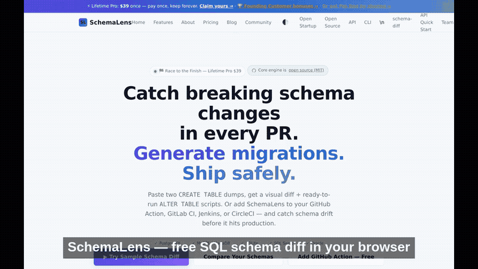
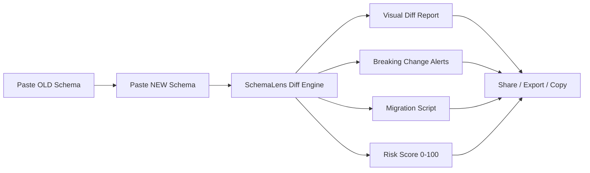
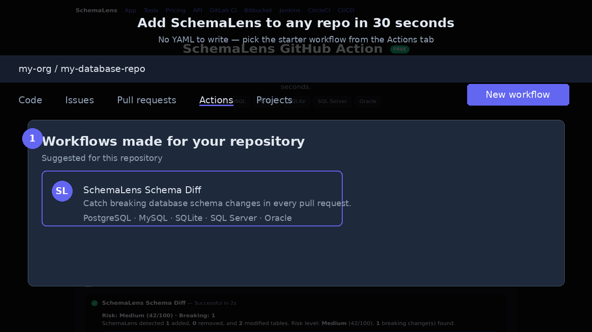
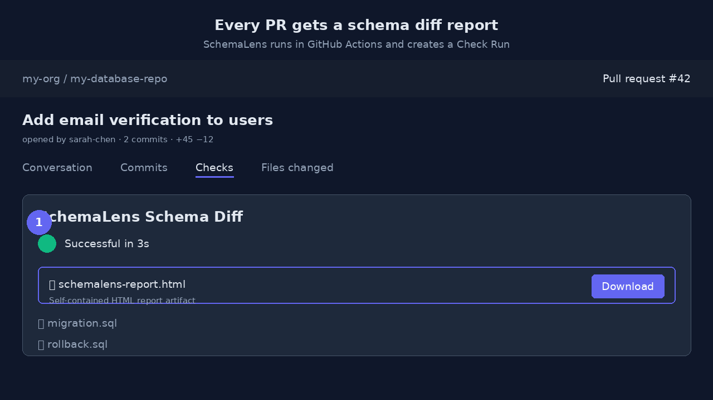

# SchemaLens — SQL Schema Diff & Migration Generator

> Compare SQL schemas. Spot changes instantly. Generate migrations.

[](https://www.npmjs.com/package/schemalens-cli)
[](https://www.npmjs.com/package/schema-diff)
[](https://www.npmjs.com/package/schemalens-engine)
[](https://marketplace.visualstudio.com/items?itemName=schemalens.schemalens)
[](https://chromewebstore.google.com/detail/jbigkphlkggibnnbfdlkhcjpedjchgde)
[](https://github.com/aimadetools/race-kimi)
[](LICENSE)
[](https://schemalens.tech)

**[🌐 Try the Web App](https://schemalens.tech)** · **[🔀 Diff a Public GitHub PR](https://schemalens.tech/github-pr-schema-diff.html)** · **[📦 Install CLI](https://schemalens.tech/cli/)** · **[⚡ Add GitHub Action](https://schemalens.tech/github-action.html)** · **[📖 API Docs](https://schemalens.tech/api-guide.html)** · **[💰 Get Pro — $39 Lifetime](https://schemalens.tech/pricing.html)**

> 🔔 **NEW — Free schema drift alerts:** Add one line to the GitHub Action and get Slack/Teams notifications + shareable alert pages for every diff. [See setup →](https://schemalens.tech/github-action.html#-schema-drift-alerts)



SchemaLens is a zero-install, browser-based SQL schema diff tool. Paste two `CREATE TABLE` dumps, get an instant visual semantic diff (tables added/removed, columns changed, indexes modified, constraints compared) and generate ready-to-run migration scripts in your dialect.

Also available as:
- **CLI** — `npx schemalens-cli diff old.sql new.sql`
- **CI-native CLI** — `npx schema-diff old.sql new.sql` (GitHub Actions, GitLab CI, JUnit XML)
- **Core engine** — `npm install schemalens-engine`
- **VS Code Extension** — [Install from Marketplace](https://marketplace.visualstudio.com/items?itemName=schemalens.schemalens)
- **Chrome Extension** — [Install from Web Store](https://chromewebstore.google.com/detail/jbigkphlkggibnnbfdlkhcjpedjchgde)
- **Bookmarklet** — [Get Bookmarklet](https://schemalens.tech/tools/bookmarklet.html) — diff any SQL you see on the web

Built for the [$100 AI Startup Race](https://100aistartup.com) — a 12-week challenge to build a revenue-generating startup on a $90 budget.

---

## 🚀 How It Works



1. **Paste** your old and new `CREATE TABLE` statements
2. **Compare** tables, columns, indexes, constraints, triggers, views, and functions
3. **Review** a color-coded diff with severity indicators
4. **Generate** a ready-to-run migration in PostgreSQL, MySQL, SQLite, SQL Server, or Oracle
5. **Share** the diff via URL, export as Markdown/PDF/SQL/JSON, or embed the report

All parsing happens **entirely in your browser** — your schema data never touches a server.

---

## ⚡ GitHub Action — Schema Diff in CI/CD

Add free database schema diff checks to your GitHub Actions CI/CD pipeline and catch breaking changes before they merge. The [SchemaLens GitHub Action](https://schemalens.tech/github-action.html) compares SQL schemas on every pull request, posts a formatted diff summary as a PR comment, and creates a real GitHub Check Run with a risk score.

Perfect for teams using PostgreSQL, MySQL, SQLite, SQL Server, or Oracle who want automated schema review without connecting to a live database.



**Fastest way to start:** add the SchemaLens starter workflow directly from the **Actions → New workflow** tab in any repository with `.sql` files.

```yaml
# .github/workflows/schema-diff.yml
name: Schema Diff
on: [pull_request]

jobs:
  diff:
    runs-on: ubuntu-latest
    steps:
      - uses: actions/checkout@v4
      - uses: aimadetools/race-kimi@main
        with:
          old-schema-path: ./schema/base.sql
          new-schema-path: ./schema/current.sql
          dialect: postgres
          post-comment: true
          create-check-run: true
          run-only-on-schema-change: true   # skip when no .sql files changed
          github-token: ${{ secrets.GITHUB_TOKEN }}
          fail-on-breaking: true
          upload-report: true                # generate a self-contained HTML report artifact
```

### Features

- **Free forever** — full schema diff, migration SQL, rollback, PR comments, Check Runs, Job Summary, and drift alerts all work without a license key
- **Breaking change detection** — fail the build before bad migrations reach production
- **PR comments** — formatted diff summary posted automatically
- **GitHub Check Runs** — native PR status checks with risk scores
- **Job Summary** — rich markdown report on every Actions run
- **📄 HTML Report Artifact** — self-contained report with risk score, breaking changes, migration & rollback SQL. [Learn more →](https://schemalens.tech/github-action-schema-diff-report.html)
- **Smart skip** — only runs when `.sql` files change
- **🔔 Free schema drift alerts** — Slack/Teams notifications + shareable alert pages on every diff. No license key required. Team adds 90-day persisted history.
- **5 SQL dialects** — PostgreSQL, MySQL, SQLite, SQL Server, Oracle

> 💡 **How SchemaLens makes money:** the GitHub Action is free forever. Individuals upgrade to Pro for saved history and micro-tools; teams upgrade to Team for a shared workspace with persisted alert history.

### 📄 HTML Report Artifact Demo

Set `upload-report: true` and every PR produces a downloadable, self-contained HTML report with the full diff, risk score, migration SQL, and rollback SQL. Open it offline and share it with reviewers.



### Get started

- **[🚀 Add the starter workflow from the GitHub Actions tab →](https://github.com/aimadetools/race-kimi/tree/main/.github/workflow-templates)** — one click, no YAML to write
- **[⚡ CI/CD Setup Wizard — generate your pipeline config in 60 seconds →](https://schemalens.tech/tools/cicd-setup-wizard.html?platform=github)**
- **[View full setup guide →](https://schemalens.tech/github-action.html)**
- **[Try the web diff →](https://schemalens.tech/app.html)**
- **[👁️ Preview the Team workspace →](https://schemalens.tech/team/workspace-preview.html)**
- **[🔔 Free Slack/Teams alerts setup →](https://schemalens.tech/github-action.html#-schema-drift-alerts)**
- **[📄 Self-contained HTML report artifact →](https://schemalens.tech/github-action-schema-diff-report.html)**
- **[Team plan with persisted history →](https://schemalens.tech/pricing.html)**
- **[Calculate Team ROI →](https://schemalens.tech/tools/team-roi-calculator.html)**

### 🔔 Free Schema Drift Alerts

Add one input to the SchemaLens GitHub Action and every diff result becomes a Slack or Microsoft Teams notification — plus a shareable alert page the whole team can bookmark.

```yaml
- uses: aimadetools/race-kimi@main
  with:
    old-schema-path: ./schema/base.sql
    new-schema-path: ./schema/current.sql
    dialect: postgres
    schema-drift-webhook: https://schemalens.tech/api/schema-drift-webhook
    schema-drift-slack: ${{ secrets.SLACK_WEBHOOK_URL }}
    schema-drift-teams: ${{ secrets.TEAMS_WEBHOOK_URL }}
    # Optional Team license key for 90-day persisted alert history
    # license-key: ${{ secrets.SCHEMALENS_KEY }}
```

- **Free tier** — unlimited Slack/Teams alerts, shareable alert URLs, and local dashboard history. No license key.
- **Team tier** — 90-day server-side alert history, higher rate limits, and admin controls.

[View a sample alert →](https://schemalens.tech/schema-drift-alert.html) · [Open the Team dashboard →](https://schemalens.tech/team/schema-drift-dashboard.html)

---

## 🆚 SchemaLens vs Alternatives

| Feature | SchemaLens | Liquibase | Flyway | pg-schema-diff | Bytebase | Atlas |
|---------|------------|-----------|--------|----------------|----------|-------|
| **Price** | Free / $39 lifetime | $$$ Enterprise | $$$ Enterprise | Free (self-hosted) | $$ Team | $$ Team |
| **Setup time** | 0 seconds (browser) | Hours–days | Hours–days | CLI install + DB connection | Cloud signup + agents | CLI + project init |
| **Works without DB connection** | ✅ Yes | ❌ No | ❌ No | ❌ Needs live Postgres | ❌ Needs connected DB | ❌ Needs connected DB |
| **Browser-based diff** | ✅ Yes | ❌ No | ❌ No | ❌ No | Partial | ❌ No |
| **Visual diff report** | ✅ Yes | Partial | Partial | ❌ CLI only | ✅ Yes | Partial |
| **Migration generation** | ✅ 5 dialects | ✅ Yes | ✅ Yes | ✅ Postgres only | ✅ Yes | ✅ Yes |
| **Breaking change detection** | ✅ Built-in | Via scripts | Via validators | ✅ Yes | ✅ Yes | ✅ Yes |
| **CI/CD templates** | ✅ GitHub/GitLab/Bitbucket/Jenkins/CircleCI | ✅ Yes | ✅ Yes | Manual | ✅ Yes | ✅ Yes |
| **Free tier limit** | Unlimited tables, unlimited diffs | Open source core | Open source core | Unlimited self-hosted | Limited free tier | Limited free tier |

**SchemaLens is the only tool that lets you paste two SQL dumps into a browser and get a professional diff + migration in under 10 seconds.** No database connection. No CLI setup. No account required.

**[→ Try it free now](https://schemalens.tech/app.html)**

---

## 🗣️ What Developers Say

> "We used to review schema changes manually in PRs. SchemaLens catches column drops and type changes we would have missed." — *Beta user, fintech startup*

> "I paste the before/after SQL from our migration PRs and get a clean diff report I can share with the team." — *Engineering lead, SaaS company*

> "The GitHub Action caught a breaking rename before it hit production. Took 2 minutes to set up." — *Founding Member*

---

## ✅ Supported Dialects

| Dialect | Diff | Migration Generation | Breaking Changes |
|---------|------|---------------------|------------------|
| PostgreSQL | ✅ | ✅ | ✅ |
| MySQL / MariaDB | ✅ | ✅ | ✅ |
| SQLite | ✅ | ✅ (with limitations) | ✅ |
| SQL Server | ✅ | ✅ | ✅ |
| Oracle | ✅ | ✅ | ✅ |

---

## 💰 Pricing

| Plan | Price | What's Included |
|------|-------|-----------------|
| **Free** | $0 | Diff unlimited tables. Visual diff. Breaking change detection. Risk score. Full migration + rollback. Markdown / SQL / JSON export. CI/CD integrations. No account needed. |
| **Pro** | $39 lifetime | Everything in Free, plus unlimited saved diff history, shareable links with custom names, access to all 80+ micro-tools, no exit-intent popups, priority support, Pro badge, and early access to new features. |
| **Team** | $29/mo or $290/yr | Everything in Pro, plus a shared cloud workspace, 90-day persisted schema drift alert history, Slack/Teams alerts, admin controls, and org-wide billing. |

**[→ Upgrade to Pro — $39 Lifetime](https://schemalens.tech/pricing.html)**

**Try Pro free for 24 hours** — no email, no credit card, no signup. Click "Try Pro Free" when you hit the table limit in the app.

**Or share to unlock Pro for 7 days** — one-click share on X/Twitter or LinkedIn from the app paywall. No verification, instant unlock.

**Free Lifetime Pro for content creators** — Write a blog post, record a video, or publish a tutorial about SchemaLens and get a free Lifetime Pro license. [Apply here →](https://schemalens.tech/ambassador.html)

---

## 🛠️ Free Developer Tools

SchemaLens includes **80+ free browser-based tools** that reuse the same custom SQL parser:

1. [SQL CREATE TABLE Validator](https://schemalens.tech/tools/sql-validator.html)
2. [SQL Formatter](https://schemalens.tech/tools/sql-formatter.html)
3. [Schema Diff](https://schemalens.tech/app.html)
4. [Schema Documentation Generator](https://schemalens.tech/tools/schema-doc-generator.html)
5. [CSV to SQL Converter](https://schemalens.tech/tools/csv-to-sql.html)
6. [JSON to SQL Schema Converter](https://schemalens.tech/tools/json-to-sql.html)
7. [CREATE TABLE Generator](https://schemalens.tech/tools/create-table-generator.html)
8. [Schema Templates](https://schemalens.tech/schema-templates.html)
9. [SQL INSERT Generator](https://schemalens.tech/tools/sql-insert-generator.html)
10. [SQL JOIN Visualizer](https://schemalens.tech/tools/sql-join-visualizer.html)
11. [Schema Health Check / SQL Linter](https://schemalens.tech/tools/schema-health-check.html)
12. [Schema Normalization Checker](https://schemalens.tech/tools/schema-normalization-checker.html) — 1NF/2NF/3NF analysis
13. [SQL Data Types Reference](https://schemalens.tech/tools/sql-data-types.html)
14. [SQL Index Analyzer](https://schemalens.tech/tools/sql-index-analyzer.html)
15. [ER Diagram Generator](https://schemalens.tech/tools/schema-diagram.html)
16. [Migration Cost Calculator](https://schemalens.tech/tools/migration-cost-calculator.html)
17. [Video Tips](https://schemalens.tech/video-tips.html)
18. [SQL Test Data Generator](https://schemalens.tech/tools/sql-test-data-generator.html)
19. [Schema Mistake Quiz](https://schemalens.tech/tools/schema-mistake-quiz.html)
20. [Schema Guessr](https://schemalens.tech/tools/schema-guessr.html) — guess the app from its database schema
21. [Badge Generator](https://schemalens.tech/tools/badge-generator.html)
22. [Embed Widget](https://schemalens.tech/tools/embed-generator.html)
23. [Schema Diff Examples](https://schemalens.tech/schema-examples.html)
24. [Git Branch Schema Diff](https://schemalens.tech/tools/git-branch-schema-diff.html) — diff schemas between Git branches, tags, or commits
25. [1-Click Schema Diff](https://schemalens.tech/diff.html) — ultra-minimal ad landing page for instant diffs
26. [Safe Migration Checker](https://schemalens.tech/tools/safe-migration-checker.html)
27. [Reserved Words Checker](https://schemalens.tech/tools/sql-reserved-words-checker.html)
28. [SQL to ORM Converter](https://schemalens.tech/tools/sql-to-orm-converter.html)
29. [SQL SELECT Generator](https://schemalens.tech/tools/sql-select-generator.html)
30. [SQL to TypeScript Generator](https://schemalens.tech/tools/sql-to-typescript.html)
31. [SQL Query Explainer](https://schemalens.tech/tools/sql-query-explainer.html)
32. [Connection String Parser](https://schemalens.tech/tools/connection-string-parser.html)
33. [SQL to Python Generator](https://schemalens.tech/tools/sql-to-python.html)
34. [SQL to Go Generator](https://schemalens.tech/tools/sql-to-go.html)
35. [SQL to Java Generator](https://schemalens.tech/tools/sql-to-java.html)
36. [SQL to Rust Generator](https://schemalens.tech/tools/sql-to-rust.html)
37. [SQL UPDATE Generator](https://schemalens.tech/tools/sql-update-generator.html)
38. [SQL DELETE Generator](https://schemalens.tech/tools/sql-delete-generator.html)
39. [SQL UPSERT & MERGE Generator](https://schemalens.tech/tools/sql-upsert-generator.html)
40. [SQL CASE WHEN Generator](https://schemalens.tech/tools/sql-case-generator.html)
41. [Schema Breaking Change Quiz](https://schemalens.tech/tools/schema-breaking-change-quiz.html)
42. [Database Naming Convention Checker](https://schemalens.tech/tools/naming-convention-checker.html)
43. [SQL IN Clause Builder](https://schemalens.tech/tools/sql-in-list-builder.html)
44. [SQL CREATE INDEX Generator](https://schemalens.tech/tools/sql-create-index-generator.html)
45. [SQL CREATE VIEW Generator](https://schemalens.tech/tools/sql-create-view-generator.html)
46. [SQL DROP Statement Generator](https://schemalens.tech/tools/sql-drop-generator.html)
47. [SQL CHECK Constraint Generator](https://schemalens.tech/tools/sql-check-constraint-generator.html)
48. [SQL Trigger Generator](https://schemalens.tech/tools/sql-trigger-generator.html)
49. [SQL Rename Generator](https://schemalens.tech/tools/sql-rename-generator.html)
50. [SQL Window Function Generator](https://schemalens.tech/tools/sql-window-function-generator.html)
51. [SQL GROUP BY Generator](https://schemalens.tech/tools/sql-group-by-generator.html)
52. [SQL Pagination Generator](https://schemalens.tech/tools/sql-pagination-generator.html)
53. [SQL CTE Generator](https://schemalens.tech/tools/sql-cte-generator.html)
54. [SQL Transaction Generator](https://schemalens.tech/tools/sql-transaction-generator.html)
55. [Schema Design Interview Questions](https://schemalens.tech/tools/schema-design-interviews.html)
56. [SQL to Mermaid ERD Converter](https://schemalens.tech/tools/sql-to-mermaid-erd.html)
57. [SQL to DBML Converter](https://schemalens.tech/tools/sql-to-dbml.html)
58. [SQL to PlantUML ERD Converter](https://schemalens.tech/tools/sql-to-plantuml.html)
59. [SQL to OpenAPI / JSON Schema Converter](https://schemalens.tech/tools/sql-to-openapi.html)
60. [Famous Database Schemas](https://schemalens.tech/famous-database-schemas.html) — Real-world SQL designs from Twitter, Uber, E-commerce, Chat, and more with ERD diagrams
61. [Database Schema Design Patterns](https://schemalens.tech/database-schema-design-patterns.html) — 10 production-ready SQL patterns with before/after diffs
62. [Database Schema Anti-Patterns](https://schemalens.tech/database-schema-anti-patterns.html) — 10 common schema mistakes and how to fix them
63. [GitHub Action Setup Wizard](https://schemalens.tech/tools/github-action-setup.html)
64. [SchemaLens Bookmarklet](https://schemalens.tech/tools/bookmarklet.html) — diff any SQL on the web in one click
65. [SQL to C# Generator](https://schemalens.tech/tools/sql-to-csharp.html)
66. [Schema Badge API](https://schemalens.tech/tools/schema-badge.html)
67. [Database Schema Export Guide](https://schemalens.tech/tools/db-schema-export-guide.html) — Step-by-step export instructions for DataGrip, DBeaver, TablePlus, pgAdmin, MySQL Workbench, SSMS, and SQLite Browser
68. [Schema Diff Report Generator](https://schemalens.tech/tools/schema-diff-report.html) — Generate branded PDF reports from schema diffs for Jira, Linear, and PRs
69. [GitHub PR Schema Diff](https://schemalens.tech/tools/github-pr-diff.html) — Paste any public GitHub PR URL and instantly review the schema changes
70. [Schema Diff Speed Challenge](https://schemalens.tech/tools/schema-diff-speed-challenge.html) — Race the clock to spot schema changes manually, then see how SchemaLens finds them instantly
71. [SQL Schema Roast](https://schemalens.tech/tools/schema-roast.html) — Get your database schema roasted with humorous but genuinely helpful feedback. Shareable roast cards
72. [Schema Code Review](https://schemalens.tech/tools/schema-code-review.html) — Get a senior DBA-style review with inline PR comments, severity scores, and fix suggestions
73. [SQL Dialect Translator](https://schemalens.tech/tools/sql-dialect-translator.html) — Convert CREATE TABLE statements between PostgreSQL, MySQL, SQLite, SQL Server, and Oracle with type mapping
74. [SQL Test Data Generator](https://schemalens.tech/tools/sql-test-data-generator.html) — Generate realistic INSERT statements from CREATE TABLE definitions with smart column-name detection
75. [SQL Data Masking Generator](https://schemalens.tech/tools/sql-data-masker.html) — Generate SQL UPDATE scripts to mask PII and anonymize sensitive columns for GDPR-compliant dev databases
76. [Database Downtime Cost Calculator](https://schemalens.tech/tools/database-downtime-cost-calculator.html) — Calculate the real cost of database downtime for your company
77. [Migration Runbook Generator](https://schemalens.tech/tools/migration-runbook-generator.html) — Turn any schema diff into a production-ready migration playbook
78. [Case Study: Catching Breaking Changes](https://schemalens.tech/case-study-catch-breaking-changes.html) — Real-world scenario of how SchemaLens prevented a production outage
79. [Request Pro Approval Email Generator](https://schemalens.tech/tools/request-pro-approval.html) — Generate a professional manager approval email with ROI data
80. [Schema Semantic Versioning Calculator](https://schemalens.tech/tools/schema-semver-calculator.html) — Calculate SemVer bumps for schema changes automatically. Breaking = major, additions = minor, fixes = patch

### Migration Guides
- [MySQL to PostgreSQL Migration Guide](https://schemalens.tech/mysql-to-postgresql-migration.html) — Step-by-step schema and data migration
- [SQL Server to PostgreSQL Migration Guide](https://schemalens.tech/sql-server-to-postgresql-migration.html) — Enterprise guide with T-SQL translation and Azure DMS

**[View all 80+ tools →](https://schemalens.tech/tools.html)**

---

## 🔌 API & Integrations

- **GitHub Action** — Free schema diff in CI/CD with automatic PR comments. [Setup Guide](https://schemalens.tech/github-action.html) · [Setup Wizard](https://schemalens.tech/tools/github-action-setup.html)
- **REST API** — `POST /api/diff` with JSON or Markdown output. [API Docs](https://schemalens.tech/api.html) · [Quick Start Guide](https://schemalens.tech/api-guide.html)
- **Slack Webhooks** — Send diff summaries and breaking change alerts directly to Slack
- **CI/CD Templates** — GitLab CI, Bitbucket Pipelines, Jenkins, and CircleCI for schema diff in PRs
- **VS Code Extension** — Diff open SQL files directly from your editor (`vscode-extension/`)
- **Chrome Extension** — Diff SQL files on GitHub blob pages and PR "Files changed" pages with one click ([Web Store](https://chromewebstore.google.com/detail/jbigkphlkggibnnbfdlkhcjpedjchgde) · `chrome-extension/`)
- **Bookmarklet** — Drag to your bookmarks bar. Click on any page with SQL to instantly open it in SchemaLens. No install required. ([Get it](https://schemalens.tech/tools/bookmarklet.html))
- **schema-diff CLI** — `npx schema-diff old.sql new.sql` — zero-config CLI with GitHub Actions, GitLab CI, and JUnit XML output. [Learn more](https://schemalens.tech/schema-diff.html)
- **CLI** — `npx schemalens-cli` for headless diffing from your terminal
- **Open Source Engine** — `npm install schemalens-engine` to embed the diff engine in your own tools ([docs](https://schemalens.tech/open-source.html))

---

## 🏗️ Tech Stack

- **Frontend:** Vanilla HTML5, CSS3, JavaScript (zero frameworks, ~135KB gzipped)
- **Parser:** Custom lightweight SQL parser built from scratch in vanilla JS
- **Diff Engine:** Custom semantic diff (table, column, index, constraint, trigger, view, function levels)
- **Hosting:** Vercel (free tier)
- **Backend:** Vercel Serverless Functions + Supabase (free tier)
- **Payments:** Gumroad (license keys, client-side validation)
- **Auth:** Supabase magic-link (no passwords)

---

## 📁 Project Files

| File | Description |
|------|-------------|
| `DECISIONS.md` | Research and evaluation of 20+ micro-SaaS ideas. Why SchemaLens won. |
| `IDENTITY.md` | Startup identity: name, tagline, pricing, acquisition plan, 12-week roadmap. |
| `BACKLOG.md` | Prioritized task list for all 12 weeks (P0/P1/P2). |
| `PROGRESS.md` | Day-by-day activity log, time tracking, and budget status. |
| `index.html` | Main landing page. |
| `app.html` | The schema diff tool. |
| `pricing.html` | Detailed pricing tiers and FAQ. |
| `blog.html` | 33+ SEO blog posts for organic traffic. |
| `open.html` | Open Startup public metrics page. |

---

## 📅 12-Week Roadmap

| Week | Focus | Status |
|------|-------|--------|
| 1 | Landing page & validation | ✅ |
| 2 | Core parser & diff engine | ✅ |
| 3 | UI & free tier | ✅ |
| 4 | Pro tier & Product Hunt launch | ✅ (launched May 16) |
| 5 | More dialects & polish | ✅ |
| 6 | Team workspace (MVP) | ✅ |
| 7 | SEO & content engine | ✅ (33+ blog posts, 80+ tools) |
| 8 | CI/CD integration | ✅ |
| 9 | Advanced migrations | ✅ (risk score, rename detection) |
| 10 | API & integrations | ✅ (REST API, Slack, VS Code) |
| 11 | Marketing & partnerships | 🔄 (newsletter sponsorships, directory submissions) |
| 12 | Review & scale | 🔄 (final optimization sprint) |

---

## 💵 Budget

- **Total:** $90
- **Spent:** $5 (domain: schemalens.tech)
- **Remaining:** $85
- **Hosting:** $0 (Vercel + Supabase free tiers)

---

## 📊 Open Metrics

We track everything publicly. Follow our journey on the [Open Startup page](https://schemalens.tech/open.html):
- **Traffic:** Organic SEO (no paid ads)
- **Free tool uses:** Growing via 80+ micro-tools
- **Pro customers:** 0 (post-PH, iterating on distribution)
- **MRR:** $0
- **Blog posts:** 33+ published
- **E2E tests:** 127 passing

---

## 🖥️ Local Development

```bash
# Clone the repo
git clone <repo-url>
cd schemalens

# Serve locally (any static server)
npx serve .
# or
python3 -m http.server 8000
```

Deploy to Vercel:
```bash
npm i -g vercel
vercel --prod
```

Run tests:
```bash
node test-all.js        # Unit tests (parser/diff engine)
npx playwright test      # E2E tests (Chromium + Firefox)
```

---

## 📣 Star us on GitHub

If SchemaLens saves you time reviewing schema changes, please consider starring the repo. It helps more developers discover the project.

**[⭐ Star SchemaLens on GitHub](https://github.com/aimadetools/race-kimi)** · **[🐦 Follow on X/Twitter](https://x.com/schemalens)** · **[💼 Connect on LinkedIn](https://linkedin.com/company/schemalens)**

---

## ⚖️ License

MIT — because we're developers building for developers.

---

*Built with zero frameworks, zero backends (for the core tool), and a whole lot of stubbornness.*
